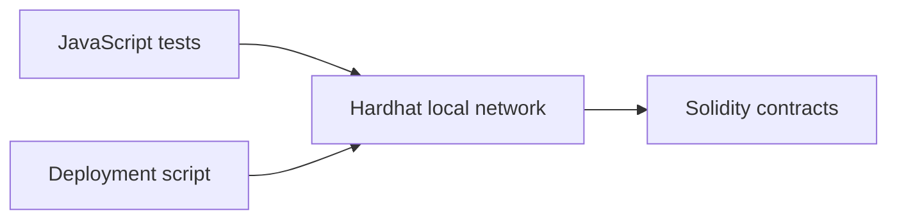

# Blockchain Essentials

## Problem

Small contracts help make smart-contract state and access rules inspectable.
This educational repository contains greeting, time-lock and number-storage examples with JavaScript tests.

## Demo

Local Hardhat examples only; no public deployment is claimed.

## Architecture



## Tech stack

Solidity, JavaScript, Hardhat and Hardhat Toolbox.

## Quickstart

```sh
npm ci
npx hardhat test
```

Use the project-local Hardhat installation. The dependencies and test results have not been revalidated during this documentation refresh.

## Evaluation

Test files exist for Greeter, Lock and NumberStorage. No pass count, coverage result or security audit is claimed.

## Design choices

Each contract demonstrates a small behavior; tests are separated from contracts and deployment code to support local inspection.

## Limitations and next steps

Educational code only. Revalidate dependencies and tests, simplify the dependency manifest, add CI, and document test coverage before considering any deployment involving assets of value.
