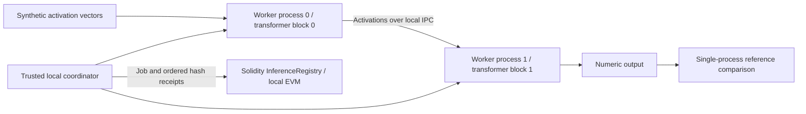

# Blockchain Inference Lab

[](https://github.com/suprkco/Blockchain-Essentials/actions/workflows/ci.yml)

**Split transformer computation off-chain, with ordered receipts on a local Ethereum-compatible chain.**

## Problem

Independent compute participants need an agreed record of who was assigned a task and what result they submitted.
This prototype separates model-block computation from blockchain accounting, and makes the gap between signed receipts and verified computation explicit.

## Demo

```sh
npm ci --ignore-scripts
npm run demo
```

The terminal displays two real child-process IDs, two recorded stage receipts, local gas usage and numerical error against a single-process reference. It saves machine-readable observations in `evaluation/demo.json`. The chain is ephemeral: no wallet, private key, public deployment or real funds are required.

**Scope:** a two-block, width-8, untrained causal transformer fixture. It computes numeric activations, not meaningful generated text. Both workers and the EVM run on one computer. This is not a trained LLM, GPU swarm, multi-machine deployment or new blockchain consensus algorithm.

## Architecture



Transformer blocks execute on workers. Blockchain blocks record transactions. Receipts are submitted after computation; the chain never executes the transformer or stores the full activations. [Architecture and trust boundaries](docs/architecture.md).

## Tech stack

Solidity, Hardhat 3, ethers, Node.js child-process IPC, SHA-256, Mocha/Chai, ESLint and GitHub Actions. The tiny transformer math uses plain JavaScript. A pinned local solc compiler avoids an extra compiler download during builds. A scoped override upgrades solc's `tmp` dependency to patched version 0.2.7; the lockfile records the exact graph.

## Quickstart

Use Node.js 24 and npm:

```sh
npm ci --ignore-scripts
npm run lint
npm test
npm run demo
```

Tests include the original Greeter, Lock and NumberStorage examples. `scripts/deploy.js` is a separate local-only deployment example; the supported inference demo is `scripts/inference-demo.js`. The project does not load `.env` or accept production credentials.

## Evaluation

Measured locally on 2026-09-30 with Node 24.18.1:

| Check | Observed result |
| --- | --- |
| Automated tests | 30 passed (original contracts + new registry and pipeline) |
| npm dependency audit | 0 reported vulnerabilities on 2026-09-30 |
| Separate worker processes | 2 |
| Completed ordered receipts | 2/2 |
| Split versus single-process maximum absolute error | 0 on the fixed input |
| Stage receipt gas | 42,969 and 42,981 local EVM gas units |


[Recorded local measurements](evaluation/demo.json) include the model-source hash, input hash, process IDs, linked receipts, output hash, gas and elapsed pipeline time. Elapsed time includes process startup and IPC; it is a single illustrative observation, not a throughput benchmark. Gas is measured on the local EVM, not a fiat price or public-chain latency estimate.

Tests check authorized stage ordering, replay rejection, hash continuity, cancellation, expiration, input bounds, causal attention, worker failure/timeout and split/reference equivalence. A deliberate negative-security test proves that the contract accepts an invented output hash from an authorized worker: correctness verification is not implemented.

No language quality, real-model memory saving, distributed speedup, GPU utilization, network resilience or cryptographic inference-proof result is claimed.

## Design choices

- **Compute outside the EVM:** a blockchain replicates execution; it does not automatically pool inference capacity. Workers perform model operations while the contract records receipts.
- **Small inspectable fixture:** two causal-attention blocks make process boundaries and numerical equivalence easy to test without downloading model weights.
- **Explicit state machine:** jobs name distinct assigned workers, a model commitment and deadline. Only the next assigned signer can advance the receipt chain.
- **No artificial token economy:** no payment, stake, slashing, fund custody or profitability claims.
- **Verification gap is tested:** hashes bind statements, not mathematical correctness. The demo's full recomputation is a trusted test oracle and negates compute savings.
- **Plain terminal experience:** no dashboard. JSON artifacts support inspection and reproducibility.

## Limitations and next steps

The coordinator controls scheduling and local signers. Workers communicate through local IPC, not an authenticated network. No trained checkpoint, tokenizer, language-model head, KV cache, peer discovery, payment, fault-tolerant routing or trustless verification exists. Hashes do not protect low-entropy inputs; activations can leak information. Only synthetic/public data belongs in this demo.

The next substantial milestone is a licensed trained model partitioned across real machines, with output-equivalence tests and measurements of per-worker memory, activation traffic and token latency. A production ledger would need batching and a defensible correctness/availability mechanism. If all workers share one trusted operator, a scheduler and database may be more appropriate than blockchain.

[Petals](https://github.com/bigscience-workshop/petals) demonstrates distributed execution of trained model blocks; it is background research, not an integration or a source of benchmark claims here. [Ethereum's oracle documentation](https://ethereum.org/developers/docs/oracles/) explains the off-chain/on-chain trust boundary. [Interview walkthrough](docs/interview.md).

Original AI-assisted portfolio prototype by Kilian Codaccioni. No employer/client data. See [NOTICE](NOTICE) for licensing of retained educational examples; existing SPDX notices remain authoritative.
