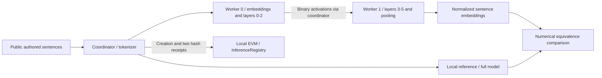

# Adaptive Inference Network

[](https://github.com/suprkco/Blockchain-adaptive-inference-network/actions/workflows/ci.yml)

**A trained-model benchmark for split inference and blockchain accounting overhead.**

[White paper v0.2](docs/whitepaper.md) | [PDF](output/pdf/adaptive-inference-network-whitepaper-v0.2.pdf) | [Methodology](docs/benchmark.md) | [Verification decision](docs/verification-decision.md)

## Problem

Distributing inference introduces computation, transport and accounting costs that should be measured separately.
This repository asks whether splitting a real embedding model offers useful tradeoffs, and shows exactly what an on-chain receipt can and cannot establish.

## Demo

The primary experiment runs **all-MiniLM-L6-v2**, a trained sentence-embedding model, on CPU. The first persistent worker owns embeddings and encoder layers 0-2; the second owns layers 3-5 and masked mean pooling with L2 normalization. Both run on one host with binary IPC relayed through the coordinator.

```console
MiniLM / trained embeddings / CPU / milliseconds (p50)
CASE                 LOCAL    SPLIT    CODEC    LEDGER   END-TO-END
single-short            10.50    12.41     0.66     4.80    17.90
batch-four              21.02    23.47     0.70     5.11    29.97
batch-two-long          66.56    72.21     0.83     4.92    78.14
```

Actual observations on one Windows CPU machine, 30 September 2026. The split and ledger paths were **slower** than local forward computation in this experiment. This is a systems result, not evidence of distributed speedup or a model-quality evaluation.

## Architecture



The coordinator creates the job, requests split computation, then records two ordered receipts. The contract verifies signer, order and hash continuity. **It does not verify inference correctness.** A test deliberately accepts a fabricated output hash from an assigned worker.

## Tech stack

PyTorch CPU, Transformers, NumPy, Python multiprocessing, Node.js, Solidity, Hardhat 3, ethers, pytest, Mocha/Chai, ESLint and GitHub Actions. Checkpoint revision: `1110a243fdf4706b3f48f1d95db1a4f5529b4d41`. No remote model code or pickle tensor transport.

## Quickstart

Use Node 24 and Python 3.10+. From the repository root:

```sh
python -m venv .venv
# Activate .venv for your shell, then:
python -m pip install torch==2.10.0 --index-url https://download.pytorch.org/whl/cpu
python -m pip install -r requirements-benchmark.txt
npm ci --ignore-scripts
npm run benchmark
```

The first run downloads the public checkpoint into the Hugging Face cache. No API key, wallet or real funds are used. `BENCH_PYTHON` can point to a Python executable if it is not on PATH. `BENCH_REPEATS` defaults to 20 per workload; all observations are saved to `evaluation/embedding-benchmark.json`.

```sh
python -m pytest tests/test_embedding.py -q
python -m benchmark.failures
npm test
npm run lint
```

`npm run demo` retains the smaller untrained two-block fixture for a Node-only introduction. It is not the trained-model benchmark.

## Evaluation

Three workload shapes, three warm-up passes per execution path, one ledger warm-up per case, **20 measured repetitions per case**, alternating local-first and split-first order. CPU float32/eager attention, one PyTorch thread per process. Tokenization, download, initialization and deployment are outside the warm timed interval. Full protocol and environment are in the artifact.

| Workload | Local p50 ms | Split p50 ms | Tensor codec p50 ms | Ledger calls p50 ms | Split + ledger p50 ms |
| --- | ---: | ---: | ---: | ---: | ---: |
| single-short | 10.50 | 12.41 | 0.66 | 4.80 | 17.90 |
| batch-four | 21.02 | 23.47 | 0.70 | 5.11 | 29.97 |
| batch-two-long | 66.56 | 72.21 | 0.83 | 4.92 | 78.14 |

Local means the original model's forward pass and normalized pooling. Split includes the two worker computations, tensor transport, hashes and orchestration. Tensor codec is a **subset** of split time. Ledger calls time job creation and two mined receipts. End-to-end is separately measured and also includes the Node/Python bridge; medians are not additive. **Local EVM automining is not distributed consensus or public-chain latency.**

All 60 measured split results matched the local embeddings exactly in the recorded environment; the acceptance tolerance was fixed at 1e-5. Tests also check padding invariance. There are **30 JavaScript/contract tests and 13 Python tests**. [Raw samples](evaluation/embedding-benchmark.json), [fault observations](evaluation/failures.json), and [p95 values and scope](docs/benchmark.md) are published. These are descriptive measurements from one session, not independent-machine trials.

## Design choices

- **Measure before claiming a protocol.** The current deliverable is a benchmark, not a production DePIN service.
- **Use an actual trained encoder.** Its useful output is a sentence embedding for semantic retrieval; no generative LLM capability or new training result is claimed.
- **Separate sources of overhead.** Persistent workers remove repeated process startup from warm runs; startup is reported separately.
- **Keep a falsification test.** Mismatched hashes cannot determine a dishonest party. No stake, reward or slashing rule substitutes for an adjudicator.
- **No simulated proof.** The project has no ZK verifier, enclave attestation or claimed trustless computation.
- **Retain raw observations.** No outlier removal or favorable-run selection. Failures are explicit and are not retried silently.

## Limitations and next steps

One host and local IPC do not measure WAN transfer, remote administration, real consensus, memory savings or fault recovery. Workers initially load the full checkpoint before retaining their assigned modules; peak initialization memory is not a sharding result. The benchmark has no concurrency sweep and uses three authored workloads, not an independent model-quality dataset. No adaptive scheduler, staking, cryptographic proof or governance system is implemented.

Next: run the same protocol across two physical machines, add controlled link delays/bandwidth and outage schedules, then compare an ordinary receipt database with a genuine independently operated ledger. Verification experiments must define how correct execution is adjudicated before introducing penalties. The [white paper](docs/whitepaper.md) describes those research gates without presenting them as implemented.

Model attribution: [sentence-transformers/all-MiniLM-L6-v2](https://huggingface.co/sentence-transformers/all-MiniLM-L6-v2), Apache-2.0 according to its model card. Weights are downloaded, not republished. Original portfolio code is AI-assisted work by Kilian Codaccioni. No employer/client materials. See [NOTICE](NOTICE) for retained educational contracts and their SPDX notices.
