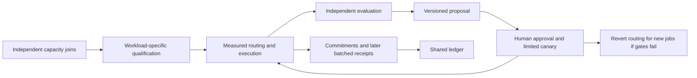

# Research roadmap

The current deliverable is a trained-model systems benchmark. The table distinguishes implemented local work from the proposed network direction. The [white paper](whitepaper.md) defines assumptions, measurement gates and stop conditions. Its [PDF edition](../output/pdf/adaptive-inference-network-whitepaper-v0.2.pdf) is generated from the same Markdown source.



| Gate | Deliverable | Status |
| --- | --- | --- |
| G0 | Local split transformer fixture and ordered receipts | Implemented; 30 tests |
| G1 | Pinned trained MiniLM encoder; normalized embedding equivalence | Implemented locally; 13 Python tests and 60 measured observations |
| G2 | Two physical machines; authenticated transport; measured failures | Proposed |
| G3 | Shadow adaptive routing against static baselines | Proposed |
| G4 | Adversarial verification experiments and accounting credits | Proposed |
| G5 | Governed version promotion and rollback for new jobs | Proposed |

Capacity, scheduling, model quality and protocol governance are separate dimensions. Node count is not an objective, and inference usage is not permission to train on prompts. A dedicated blockchain is a conditional later option; test an existing EVM settlement layer against an ordinary database first.

## Rebuilding the PDF

The PDF is committed for readers. Its optional build tool is independent of the Node runtime:

```sh
python -m pip install reportlab==5.0.1
python scripts/build-whitepaper.py
```

Visually inspect the rendered pages after editing. No simulated research outcomes should be added to the implementation's evaluation table.
